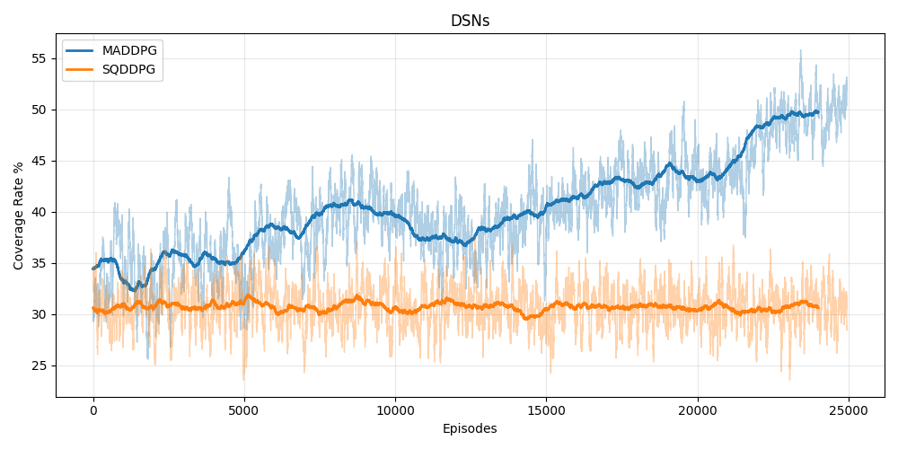
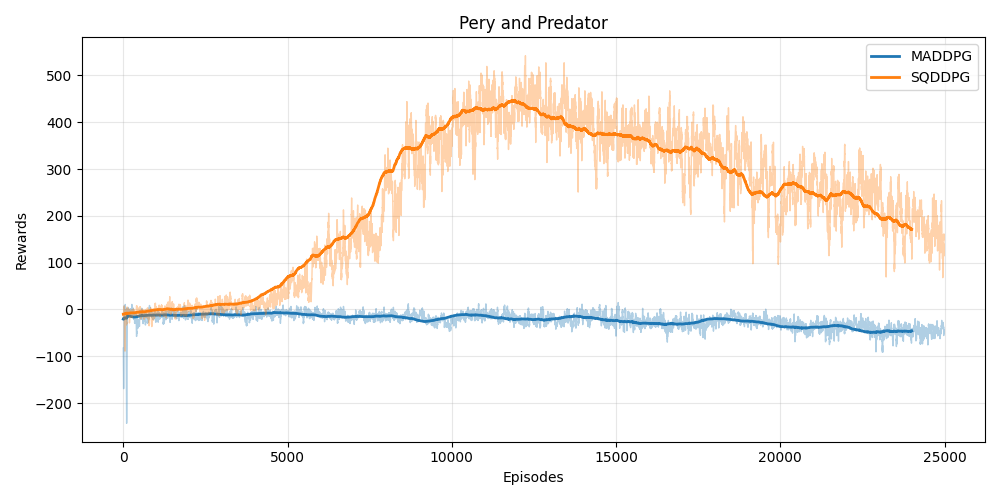

# SQDDPG


<br>
Implementation of **Shapley Q-value Deep Deterministic Policy Gradient (SQDDPG)**, a multi-agent reinforcement learning algorithm that incorporates Shapley values for fair credit assignment in cooperative tasks with global rewards.

This repository provides a comparison between SQDDPG and the baseline MADDPG algorithm on two multi-agent environments:
- A custom **DSN** (Drone Swarm Navigation-like) environment
- The `simple_tag` scenario from PettingZoo's Multi-Agent Particle Environments (MPE)

## File Structure
```
SQDDPG/
├── custom_environment/               # Custom DSN environment implementation directory
│   ├── custom_environment_v0.py      # not used
│   └── env/                          # Subdirectory for environment modules
│       └── (environment-related files/modules, updated for continuous actions support; specific files not listed but likely include env classes)
├── helper/                           # Utility and core supporting modules for agents, networks, and training
│   ├── agent.py                      # Defines the SQDDPG agent class (handles action selection, updates, etc.)
│   ├── memory_buffer.py              # Implements the replay memory buffer for storing and sampling experiences
│   ├── networks.py                   # Neural network definitions (actor, critic, scheduler, etc.)
│   └── utilities.py                  # General utility functions
├── models/                           # Directory for model implementation
│   ├── maddpg.py                   
│   └── sqddpg.py                  
├── static/                           # Directory for storing demonstration imgs, videos or training visualizations
│   ├── imgs/
│   └── videos/                    
│      
├── tmp/                              # Temporary directory for model-specific logs, caches, or intermediate
│   ├── sqddpg/                       
│   └── maddpg/                       
├── maddpg_dsn_main.py                # Training script for baseline MADDPG on the custom DSN environment
├── maddpg_main.py                    # Training script for baseline MADDPG on PettingZoo's simple_tag environment
├── requirements.txt                  # List of required Python packages and dependencies
├── sqddpg_dsn_main.py                # Training script for SQDDPG on the custom DSN environment
└── sqddpg_main.py                    # Training script for SQDDPG on PettingZoo's simple_tag environment
```
## Installation

### 1. Clone the repository:
```bash
git clone https://github.com/masao1112/SQDDPG.git
cd SQDDPG
```
### 2. Create and activate a virtual environment (recommended):
```bash
python -m venv venv
source venv/bin/activate  # On Windows: venv\Scripts\activate
```
### 3. Install dependencies:
```bash
pip install -r requirements.txt
```
This installs required libraries including PyTorch, PettingZoo, Gymnasium, and other multi-agent RL dependencies.

## Usage
### 1. Prey and Predator Environment(pettingzoo.simple_tag)
**Train with MADDPG(baseline):**
```bash 
python maddpg_main.py
```

**Train with SQDDPG:**
```bash
python sqddpg_main.py
```

### 2. DSN Environment
**Train with MADDPG(baseline):**
```bash
python maddpg_dsn_main.py
```
**Train with SQDDPG:**
```bash
python sqddpg_dsn_main.py
```

## Hyperparameter Tuning
| Hyperparameter          | Value   | Description                                      |
|-------------------------|---------|--------------------------------------------------|
| hidden units            | 128     | the # of hidden units for all layers             |
| training episodes       | 25k     | maximum training episodes                        |
| episode length          | 100     | maximum time steps per episode                   |
| discount factor         | 0.9     | discount factor for rewards, i.e. gamma          |
| learning rate           | 5e-4    | learning rate for all networks                   |
| target update frequency | 10      | target network updates every # steps             |
| target update rate      | 0.1     | target network update rate i.e tau               |
| replay buffer           | 1e4     | the size of replay buffer                        |
| batch size              | 64      | the # of transitions for each update             |
| sample size             | 6       | the # of samples to approximate shapley Q-value  |

Hyperparameters can be adjusted directly in the corresponding script files:
- For simple_tag: modify maddpg_main.py or sqddpg_main.py
- For DSN environment: modify the main scripts (maddpg_dsn_main.py / sqddpg_dsn_main.py) and environment-specific\
settings in ENV/PoseEnvLarge.py (e.g., number of agents, map size, reward parameters, etc.)

## Credits & References
> The MADDPG implementation is heavily inspired by and adapted from [Phil Tabor's repository](https://github.com/philtabor)<br>
> The DSN environment is adapted from [XuJing1022's Repository](https://github.com/XuJing1022/DSN)<br>
> The SQDDPG algorithm is based on the paper:
> [Shapley Q-value: A Local Reward Approach to Solve Global Reward Games (AAAI 2020)](https://arxiv.org/abs/1907.05707)
